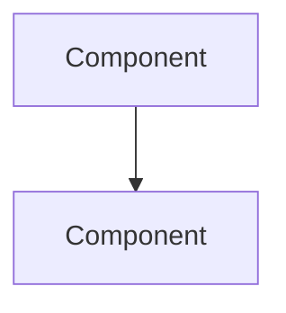
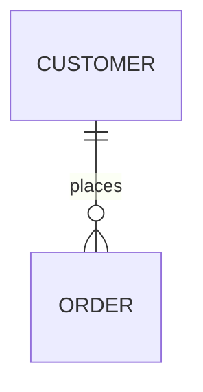

# Project Chronicler

Generate a static HTML file that captures the complete project journey from idea to validation, including timeline visualization, artifact gallery, decision log, metrics dashboard, and architecture diagrams.

## When to Use This Skill

**Manual Invocation:**
- User runs `/project-chronicle`
- User requests to "document the project journey", "generate project report", "create project summary"

**Auto-Invocation by Orchestrator:**
- Project completes a major phase (Discovery, Requirements, Architecture, Design, Implementation, QA, Security)
- A quality gate passes or fails
- Project reaches MVP or release milestone
- On explicit request to snapshot current progress

## Authority & Decision Rights

| Area | Authority Level |
|------|-----------------|
| Chronicle structure/layout | Final |
| Visual presentation | Final |
| Data aggregation approach | Final |
| Diagram generation | Final |
| What artifacts to include | Advisory (follows orchestrator guidance) |

## Inputs Required

| Input | Required | Source |
|-------|----------|--------|
| Project Status Document | Yes | Orchestrator tracking document |
| Project Brief | Yes | Discovery phase output |
| Artifacts List | Yes | All generated documents (BRD, ADRs, specs, etc.) |
| Gate History | Yes | Pass/fail records with dates |
| **Requirements Traceability Matrix** | Yes | `docs/traceability/RTM.md` |
| Feedback Logs | If Any | FEEDBACK-XXX documents |
| Test Results | If QA Complete | From qa-engineer |
| Security Review | If Complete | From security-engineer |

## Output

**File**: `chronicles/PROJECT-CHRONICLE-[ProjectName]-[Phase]-[YYYY-MM-DD].html`

A single self-contained HTML file that:
- Opens directly in any browser (no server required)
- Contains all CSS and JavaScript inline
- Uses Mermaid.js via CDN for diagrams
- Supports dark/light theme toggle
- Is print-friendly for PDF export
- Can be shared as a standalone file

## Chronicle Sections

### 1. Header & Navigation
- Project name and current status badge
- Generation timestamp
- Theme toggle (dark/light)
- Sticky navigation for section jumping
- Print/export button

### 2. Overview Dashboard
Key metrics at a glance:
- Current phase indicator
- Gates passed / total
- Days in development
- Open issues count
- Artifact count

### 3. Journey Timeline
Visual vertical timeline showing:
- Phase start/end markers with dates
- Gate checkpoints (pass: green, fail: red, pending: amber)
- Key decisions and milestones
- Feedback loop events
- Expandable details for each event

### 4. Artifact Gallery
Collapsible cards organized by category:
- **Requirements**: BRD, Requirements Catalogue, User Stories
- **Architecture**: ADRs, System Design, Tech Stack Spec
- **Data & API**: Data Model, API Specifications (OpenAPI)
- **Design**: User Flows, Wireframes, UI Specs, Design System
- **Quality**: Test Plans, Test Reports, Defect Summary
- **Security**: Security Review, Vulnerability Report
- **Deployment**: CI/CD Config, Infrastructure Spec

Each card displays:
- Artifact ID and title
- Status badge (Draft/Approved/Superseded)
- Creation and update dates
- Author (skill that produced it)
- Summary/preview (expandable)
- Related artifacts as linked chips

### 5. Requirements Traceability

**CRITICAL SECTION - Shows if the project delivered what was promised.**

Visual representation of the Requirements Traceability Matrix:

#### Coverage Summary
```
┌─────────────────────────────────────────────────────────────┐
│                  REQUIREMENTS COVERAGE                       │
├─────────────────────────────────────────────────────────────┤
│  Total Requirements: 50                                      │
│                                                              │
│  Must-Have:   25/25 (100%) ████████████████████████ ✅      │
│  Should-Have: 14/15 (93%)  █████████████████████░░░ ✅      │
│  Could-Have:  5/10  (50%)  ████████████░░░░░░░░░░░░ ⚠️      │
│                                                              │
│  Status: READY FOR RELEASE                                   │
└─────────────────────────────────────────────────────────────┘
```

#### Traceability Table
For each requirement, show:
- REQ-ID and description
- Linked User Story (US-XXX)
- Implementation status (✅/❌)
- File reference
- Test case (TC-XXX)
- Test result
- BA validation status

#### Gap Analysis
Highlight any gaps:
- Requirements without implementation
- Requirements without tests
- Requirements not validated
- Descoped items with approval status

**This section answers:** "Did we build what we said we would build?"

### 6. Decision Log
Chronological list of all decisions:
- ADR entries with full context, decision, and consequences
- Feedback loop resolutions (FEEDBACK-XXX → resolution)
- Trade-off decisions with rationale
- Requirement-linked justifications
- Status indicators (Accepted/Deprecated/Superseded)

### 6. Metrics Dashboard
Visual statistics using CSS-only charts:
- **Gate Progress**: Pass/fail/pending bar chart
- **Issue Resolution**: Defects by severity, resolved vs open
- **Test Coverage**: Pass/fail/skip percentages
- **Timeline Stats**: Days per phase visualization
- **Feedback Metrics**: Open/resolved/rejected counts

### 7. Diagrams (Mermaid.js)
Auto-generated from architecture artifacts:
- **System Architecture**: Component overview (C4-style)
- **Entity Relationship**: Data model visualization
- **Sequence Diagrams**: Key user flow interactions
- **Data Flow**: How data moves through the system
- **Deployment Topology**: Infrastructure layout

Each diagram includes:
- Title and description
- Source artifact reference
- Zoom/fullscreen capability

### 8. Workflow Visualization
Visual representation of the development process:
- Skill invocation sequence as a flowchart
- Handoff points between skills
- Feedback loops shown as return arrows
- Gate checkpoints as decision nodes
- Current position highlighted

### 9. Footer
- Generation metadata (date, version, generator)
- Chronicle schema version
- Export options

## Document Sources & Extraction Rules

The chronicle consumes artifacts from the `docs/` folder structure created by each skill during their phases. Here's exactly where to find each artifact and how to extract the data:

### Expected Directory Structure

```
project-root/
├── docs/
│   ├── product/                    # Product Strategist outputs
│   │   ├── Product_Vision_Strategy.md
│   │   ├── User_Segments.md        # Personas and segments
│   │   ├── JTBD_Framework.md       # Jobs to be done
│   │   ├── MVP_Decision_Package.md
│   │   ├── Product_Capabilities.md
│   │   ├── Success_Metrics.md
│   │   ├── Problem_Opportunity_Backlog.md
│   │   ├── Product_Principles.md
│   │   └── Product_Decision_Log.md
│   ├── requirements/               # Business Analyst outputs
│   │   ├── Business_Requirements_Document.md
│   │   ├── Requirements_Catalogue.md
│   │   ├── User_Stories.md
│   │   └── Non_Functional_Requirements.md
│   ├── architecture/               # Solution Architect outputs
│   │   ├── System_Design.md
│   │   ├── Tech_Stack.md
│   │   ├── Data_Model.md
│   │   └── adrs/
│   │       ├── ADR-001-*.md
│   │       ├── ADR-002-*.md
│   │       └── ...
│   ├── api/                        # API Designer outputs
│   │   └── API_Reference.md
│   ├── ux/                         # UX Designer outputs
│   │   ├── User_Flows.md
│   │   ├── Wireframes.md
│   │   ├── Information_Architecture.md
│   │   ├── Interaction_Patterns.md
│   │   └── Accessibility.md
│   ├── ui/                         # UI Designer outputs
│   │   ├── Design_System.md
│   │   ├── Component_Library.md
│   │   ├── Visual_Mockups.md
│   │   └── UI_Developer_Handoff.md
│   ├── testing/                    # QA/BA outputs
│   │   └── BAT_Report.md           # Business Acceptance Testing
│   ├── handoffs/                   # Handoff documents
│   │   ├── Developer_Handoff.md
│   │   ├── Developer_API_Handoff.md
│   │   ├── UX_Developer_Handoff.md
│   │   ├── BA_Handoff.md
│   │   └── Architect_Handoff.md
│   ├── security/                   # Security outputs
│   │   └── SECURITY-REVIEW.md
│   └── devops/                     # DevOps outputs
│       └── DEPLOYMENT-CONFIG.md
├── PROJECT-STATUS.md               # Orchestrator tracking document
├── FEEDBACK/
│   ├── FEEDBACK-001.md
│   └── ...
└── chronicles/                     # Chronicle output directory
```

### Skill-to-Document Mapping

| Skill | Output Location | Files to Parse |
|-------|-----------------|----------------|
| **project-orchestrator** | `./PROJECT-STATUS.md` | Phase status, gate history, issues, risks |
| **product-strategist** | `docs/product/` | Product_Vision_Strategy.md, User_Segments.md, MVP_Decision_Package.md, Success_Metrics.md |
| **business-analyst** | `docs/requirements/` | Business_Requirements_Document.md, Requirements_Catalogue.md, User_Stories.md, Non_Functional_Requirements.md |
| **business-analyst (BAT)** | `docs/testing/` | BAT_Report.md |
| **solution-architect** | `docs/architecture/` | System_Design.md, Tech_Stack.md, Data_Model.md, adrs/*.md |
| **api-designer** | `docs/api/` | API_Reference.md |
| **ux-designer** | `docs/ux/` | User_Flows.md, Wireframes.md, Information_Architecture.md, Accessibility.md |
| **ui-designer** | `docs/ui/` | Design_System.md, Component_Library.md, Visual_Mockups.md |
| **interaction-designer** | `docs/ux/` | Interaction_Patterns.md |
| **qa-engineer** | `docs/testing/` | TEST-PLAN.md, TEST-RESULTS.md, DEFECTS.md |
| **security-engineer** | `docs/security/` | SECURITY-REVIEW.md |
| **devops-engineer** | `docs/devops/` | DEPLOYMENT-CONFIG.md |
| **handoffs** | `docs/handoffs/` | *_Handoff.md files |
| *Feedback loops* | `./FEEDBACK/` | FEEDBACK-*.md |

### Detailed Extraction Rules

#### 1. PROJECT-STATUS.md (Orchestrator)

**Location**: `./PROJECT-STATUS.md`

**Extract**:
```markdown
# Look for these sections:

## Status: [Phase Name]
→ Extract: Current phase for header badge

## Completed Gates
- [x] Discovery: COMPLETE (2024-01-15)
→ Extract: Gate name, status, date for timeline

## Open Issues
| ID | Description | Owner | Priority | Status |
→ Extract: Issue counts for metrics dashboard

## Feedback Log
| ID | From | To | Issue | Status |
→ Extract: Feedback items for decision log

## Risks
| Risk | Impact | Mitigation | Owner |
→ Extract: Risk items for overview

## Artifacts Produced
- [x] Project Brief
→ Extract: Artifact completion status
```

**Chronicle Mapping**:
- `Status` → Header status badge
- `Completed Gates` → Timeline events, gate metrics
- `Open Issues` → Metrics dashboard (open issues count)
- `Feedback Log` → Decision log section
- `Risks` → Overview section risks summary

#### 2. PROJECT-BRIEF.md (Discovery)

**Location**: `docs/discovery/PROJECT-BRIEF.md`

**Extract**:
```markdown
# Project Brief: [Project Name]
→ Extract: Project name for header

## Problem Statement
[Text]
→ Extract: For overview section

## Target Users
[Text]
→ Extract: For overview section

## Success Definition
[Text]
→ Extract: For overview section

## Scope
### In Scope (MVP)
- [Feature]
→ Extract: Scope items

## Constraints
- Timeline: [X]
- Budget: [X]
→ Extract: Constraint summary

## Key Metrics
| Metric | Current | Target |
→ Extract: Success metrics for metrics dashboard
```

**Chronicle Mapping**:
- Project name → Header title
- Problem/Users/Scope → Overview brief card
- Metrics → Metrics dashboard targets

#### 3. REQUIREMENTS-CATALOGUE.md (Business Analyst)

**Location**: `docs/requirements/REQUIREMENTS-CATALOGUE.md`

**Extract**:
```markdown
## REQ-001: [Requirement Title]
**Priority**: Must/Should/Could
**Status**: Draft/Approved
**Acceptance Criteria**:
- [Criteria]

→ Extract each requirement:
  - ID (REQ-XXX)
  - Title
  - Priority
  - Status
  - Linked ADRs or test cases
```

**Chronicle Mapping**:
- Requirements → Artifact gallery (Requirements category)
- Count → Metrics dashboard (total requirements)
- ID references → Cross-linking in decision log

#### 4. ADR Files (Solution Architect)

**Location**: `docs/architecture/ADR/ADR-XXX-*.md`

**Extract**:
```markdown
# ADR-001: [Decision Title]

## Status
[Proposed/Accepted/Deprecated/Superseded]

## Date
[YYYY-MM-DD]

## Context
[Why this decision was needed]

## Decision
[What was decided]

## Consequences
### Positive
- [Benefit]
### Negative
- [Drawback]
### Risks
- [Risk]

## Related Requirements
- REQ-XXX
```

**Chronicle Mapping**:
- Full ADR → Decision log (expandable cards)
- Status/Date → Timeline events
- Consequences → Decision log details
- Related Requirements → Cross-links

#### 5. SYSTEM-DESIGN.md (Solution Architect)

**Location**: `docs/architecture/SYSTEM-DESIGN.md`

**Extract**:
```markdown
## Architecture Overview
[Description]


→ Extract Mermaid code blocks

## Components
### [Component Name]
- Responsibility: [Text]
- Technology: [Text]
→ Extract component list

## Data Flow
```mermaid
sequenceDiagram
    ...
```
→ Extract sequence diagrams
```

**Chronicle Mapping**:
- Mermaid blocks → Diagrams section (Architecture, Sequence)
- Component list → Architecture diagram enhancement
- Description → Artifact gallery summary

#### 6. DATA-MODEL.md / ERD.md (Data Architect)

**Location**: `docs/data/DATA-MODEL.md`, `docs/data/ERD.md`

**Extract**:
```markdown
## Entities

### [Entity Name]
| Field | Type | Constraints |
→ Extract entity definitions


→ Extract ER diagram
```

**Chronicle Mapping**:
- ER Mermaid block → Diagrams section (Entity Relationship)
- Entity list → Data model summary in artifacts

#### 7. API-SPECIFICATION.yaml (API Designer)

**Location**: `docs/api/API-SPECIFICATION.yaml`

**Extract**:
```yaml
openapi: 3.0.0
info:
  title: [API Name]
  version: [Version]
paths:
  /endpoint:
    get:
      summary: [Description]
→ Extract:
  - API title and version
  - Endpoint count
  - Operation summaries
```

**Chronicle Mapping**:
- API summary → Artifact gallery (API category)
- Endpoint count → Metrics
- Can generate API diagram from paths

#### 8. TEST-RESULTS.md (QA Engineer)

**Location**: `docs/qa/TEST-RESULTS.md`

**Extract**:
```markdown
## Test Execution Summary

| Total | Passed | Failed | Skipped |
|-------|--------|--------|---------|
| 150   | 142    | 5      | 3       |
→ Extract test statistics

## Failed Tests
| TC-XXX | [Description] | [Reason] |
→ Extract failed test details

## Defects Found
| DEF-XXX | Severity | Description | Status |
→ Extract defect list
```

**Chronicle Mapping**:
- Test stats → Metrics dashboard (Test Results panel)
- Pass rate → Progress bar
- Defects → Metrics dashboard (Issue Statistics)
- DEF-XXX → Timeline events if critical

#### 9. SECURITY-REVIEW.md (Security Engineer)

**Location**: `docs/security/SECURITY-REVIEW.md`

**Extract**:
```markdown
## Security Assessment

### Vulnerabilities Found
| ID | Severity | Category | Status |
| VULN-001 | High | Injection | Fixed |
→ Extract vulnerability counts by severity

### OWASP Top 10 Checklist
- [x] A01: Broken Access Control - PASS
→ Extract checklist status

### Recommendations
- [Recommendation]
→ Extract for decision log
```

**Chronicle Mapping**:
- Vulnerability counts → Metrics dashboard
- Critical/High findings → Timeline events
- Checklist → Security gate status
- Recommendations → Decision log

#### 10. FEEDBACK-XXX.md (Feedback Loops)

**Location**: `./FEEDBACK/FEEDBACK-XXX.md`

**Extract**:
```markdown
## FEEDBACK-001

**From**: qa-engineer
**To**: fullstack-developer
**Date**: 2024-01-22
**Priority**: High

### Issue
[Description]

### Status
- [x] Acknowledged
- [x] In Progress
- [ ] Fixed
- [ ] Verified
→ Extract status progression

### Resolution
[How it was resolved]
```

**Chronicle Mapping**:
- Feedback items → Decision log (Feedback Resolutions)
- From/To → Workflow visualization (feedback arrows)
- Dates → Timeline events
- Status → Metrics (resolved vs open)

### Diagram Extraction Rules

For any Mermaid diagram found in documents:

1. **Identify diagram type** from first line:
   - `graph` / `flowchart` → Architecture/Workflow
   - `sequenceDiagram` → Sequence
   - `erDiagram` → Entity Relationship
   - `stateDiagram` → State Machine
   - `classDiagram` → Class/Component

2. **Extract full code block** including opening and closing ```

3. **Note source file** for attribution

4. **Validate syntax** before including (check for common errors)

5. **Apply chronicle theme** to Mermaid config

### ID Pattern Recognition

Scan all documents for these ID patterns to build cross-references:

| Pattern | Meaning | Example |
|---------|---------|---------|
| `REQ-XXX` | Requirement | REQ-001, REQ-042 |
| `ADR-XXX` | Architecture Decision | ADR-001, ADR-015 |
| `TC-XXX` | Test Case | TC-001, TC-150 |
| `DEF-XXX` | Defect | DEF-001, DEF-023 |
| `FEEDBACK-XXX` | Feedback Item | FEEDBACK-001 |
| `VULN-XXX` | Vulnerability | VULN-001, VULN-005 |
| `ISSUE-XXX` | Open Issue | ISSUE-001 |
| `US-XXX` | User Story | US-001, US-050 |

When an ID is found, create a link to its source document or section.

## Generation Process

### Step 1: Scan Directory Structure
```
1. Check for ./PROJECT-STATUS.md (required)
2. Check for ./docs/ directory
3. List all subdirectories: discovery/, requirements/, architecture/, etc.
4. List all files in each subdirectory
5. Check for ./FEEDBACK/ directory
6. Report what was found before proceeding
```

### Step 2: Read Orchestrator Status
```
1. Read ./PROJECT-STATUS.md
2. Extract current phase
3. Extract completed gates with dates
4. Extract open issues count
5. Extract feedback log entries
6. Build initial timeline from gate history
```

### Step 3: Read Phase Documents
For each completed phase, read the corresponding docs:
```
Discovery complete → Read docs/discovery/*
Requirements complete → Read docs/requirements/*
Architecture complete → Read docs/architecture/*
... and so on
```

### Step 4: Extract Artifact Metadata
For each document:
```
1. Read the file
2. Extract title from first # heading
3. Look for status indicators (Draft/Approved/etc)
4. Extract first paragraph as summary
5. Count items (requirements, ADRs, tests)
6. Find all ID references
7. Extract any Mermaid code blocks
```

### Step 5: Build Cross-Reference Index
```
1. Collect all IDs found across documents
2. Map each ID to its source file and line
3. Find all references to each ID
4. Build relationship graph for linked items
```

### Step 6: Aggregate Metrics
```
Gates: Count passed/failed/pending from status
Requirements: Count from requirements catalogue
Tests: Extract stats from test results
Defects: Count by severity from defects/vulnerabilities
Feedback: Count resolved/open from feedback log
Timeline: Calculate days between phases
```

### Step 7: Compile Diagrams
```
1. Collect all Mermaid blocks from architecture docs
2. Collect ER diagram from data docs
3. Collect sequence diagrams from design/architecture
4. Generate workflow diagram from skill invocation order
5. Validate each diagram syntax
```

### Step 8: Render HTML
Using the template in `templates/chronicle-template.html`:
```
1. Replace {{PROJECT_NAME}} with project name
2. Replace {{CURRENT_PHASE}} with current phase
3. Replace {{TIMELINE_ITEMS}} with generated timeline HTML
4. Replace {{ARTIFACT_CARDS}} with generated cards HTML
5. Replace {{DECISION_ITEMS}} with ADR/feedback HTML
6. Replace {{GATE_METRICS}}, {{TEST_METRICS}}, etc.
7. Replace {{ARCHITECTURE_DIAGRAM}}, etc. with Mermaid code
8. Replace all date/count placeholders
```

### Step 9: Write Output
```
1. Create chronicles/ directory if not exists
2. Write HTML file with naming: PROJECT-CHRONICLE-{Name}-{Phase}-{Date}.html
3. Update PROJECT-CHRONICLE-Latest.html symlink
4. Report generated file path to user
```

## Handling Missing Data

If expected files are missing:

| Missing | Chronicle Behavior |
|---------|-------------------|
| PROJECT-STATUS.md | **ERROR**: Cannot generate - this is required |
| docs/discovery/* | Show "Discovery phase not documented" in overview |
| docs/requirements/* | Skip Requirements section in artifact gallery |
| docs/architecture/ADR/* | Show "No decisions documented" in decision log |
| docs/qa/* | Show "QA pending" in metrics |
| FEEDBACK/* | Show "No feedback loops recorded" |
| Any Mermaid diagrams | Show placeholder: "No architecture diagrams available" |

Never fail silently - always indicate what data was missing.

## Design Principles

Follow the frontend-design skill guidelines rigorously:

**Typography**:
- Display: Space Grotesk (geometric, technical - for headings)
- Body: IBM Plex Sans (clean, professional - for content)
- Mono: JetBrains Mono (for code, IDs, data)
- Load via Google Fonts CDN

**Color Palette (Dark Mode - Default)**:
```css
--bg-primary: #0f172a;      /* Deep navy - main background */
--bg-secondary: #1e293b;    /* Elevated surfaces */
--bg-tertiary: #334155;     /* Cards, inputs */
--text-primary: #f1f5f9;    /* Main text */
--text-secondary: #94a3b8;  /* Secondary text */
--accent-blue: #3b82f6;     /* Links, navigation */
--accent-success: #22c55e;  /* Passed gates, positive */
--accent-warning: #f59e0b;  /* Pending, caution */
--accent-error: #ef4444;    /* Failed, blockers */
--accent-purple: #8b5cf6;   /* Highlights, accents */
```

**Color Palette (Light Mode)**:
```css
--bg-primary: #ffffff;
--bg-secondary: #f8fafc;
--bg-tertiary: #e2e8f0;
--text-primary: #0f172a;
--text-secondary: #475569;
```

**Visual Guidelines**:
- NO generic AI aesthetics (avoid bland Inter/Roboto on white)
- Progressive disclosure via collapsible sections
- Meaningful use of color (semantic, not decorative)
- Strong visual hierarchy through typography scale
- Subtle shadows and borders for depth
- Responsive layout (works on mobile)
- Print-optimized styles (hide nav, expand all, monochrome-friendly)

## Technical Constraints

- **Self-Contained**: Single HTML file, no build step
- **External Dependencies**: Only Mermaid.js via CDN for diagrams
- **JavaScript**: Vanilla JS only (no React/Vue - simpler, more portable)
- **CSS**: Grid/Flexbox layout, custom properties for theming
- **Browsers**: Support modern browsers (Chrome, Firefox, Safari, Edge)
- **File Size**: Target < 500KB for reasonable load times

## Handoff Checklist

Before generating chronicle, verify:
- [ ] Project status document exists and is parseable
- [ ] At least one phase has been completed
- [ ] Project brief exists with problem/scope defined
- [ ] At least one artifact has been created
- [ ] Data is complete enough for meaningful visualization

## Anti-Patterns to Avoid

1. **Empty Sections**: Don't render sections with no data - hide or show placeholder
2. **Broken Diagrams**: Validate Mermaid syntax before including
3. **Stale Data**: Always use latest artifact versions
4. **Information Overload**: Use progressive disclosure, don't dump everything at once
5. **Generic Styling**: Follow design principles - make it distinctive
6. **Print Failures**: Test print styles, ensure diagrams render in print

## Integration with Orchestrator

The orchestrator should invoke this skill:

```markdown
## Chronicle Integration Points

### Auto-Generation Triggers
- After Discovery phase: Generate initial chronicle with brief and plan
- After each gate pass: Update chronicle with new phase data
- After gate failure: Generate chronicle documenting blockers
- At MVP milestone: Generate comprehensive chronicle
- At release: Generate final chronicle with full journey

### Chronicle Storage
project-root/
├── chronicles/
│   ├── PROJECT-CHRONICLE-Discovery-2024-01-15.html
│   ├── PROJECT-CHRONICLE-Requirements-2024-01-18.html
│   ├── PROJECT-CHRONICLE-Architecture-2024-01-22.html
│   └── PROJECT-CHRONICLE-Latest.html  (symlink to most recent)

### Status Document Update
Add to Project Status tracking:

## Chronicle History
| Version | Phase | Date | Status | Link |
|---------|-------|------|--------|------|
| 1 | Discovery | 2024-01-15 | Complete | [View](chronicles/...) |
```

## Template Placeholders Reference

The `chronicle-template.html` uses these placeholders that must be replaced during generation:

### Header & Overview
| Placeholder | Source | Example |
|-------------|--------|---------|
| `{{PROJECT_NAME}}` | Product Vision or BRD title | "StudyFlow" |
| `{{CURRENT_PHASE}}` | PROJECT-STATUS.md | "Architecture" |
| `{{STATUS_COLOR}}` | Phase status | "blue", "success", "warning" |
| `{{GENERATION_DATE}}` | Current date | "Jan 25, 2024" |
| `{{GENERATION_DATETIME}}` | Full timestamp | "2024-01-25 14:30:00" |
| `{{PHASE_NUMBER}}` | Current phase index | "3" |
| `{{TOTAL_PHASES}}` | Total phases | "7" |
| `{{GATES_PASSED}}` | Completed gates count | "2" |
| `{{TOTAL_GATES}}` | Total gates | "7" |
| `{{DAYS_ELAPSED}}` | Days since start | "12" |
| `{{START_DATE}}` | Project start date | "Jan 15" |

### Content Counts (for sidebar badges)
| Placeholder | Source | Description |
|-------------|--------|-------------|
| `{{PERSONA_COUNT}}` | User_Segments.md | Number of personas defined |
| `{{REQ_COUNT}}` | Requirements_Catalogue.md | Total requirements |
| `{{US_COUNT}}` | User_Stories.md | Total user stories |
| `{{ADR_COUNT}}` | adrs/*.md | Total ADR files |
| `{{OPEN_DEFECTS}}` | DEFECTS.md | Open defect count |

### Project Brief Section
| Placeholder | Source File | Section to Extract |
|-------------|-------------|-------------------|
| `{{PROBLEM_STATEMENT}}` | Product_Vision_Strategy.md | "Problem Statement" or "Problem" section |
| `{{TARGET_USERS}}` | User_Segments.md | Segment overview summary |
| `{{PROJECT_SCOPE}}` | MVP_Decision_Package.md | "In Scope" section |
| `{{CONSTRAINTS}}` | Product_Vision_Strategy.md | "Constraints" section |
| `{{SUCCESS_METRICS}}` | Success_Metrics.md | Key metrics table |
| `{{SOLUTION_SUMMARY}}` | Product_Vision_Strategy.md | "Solution" or "Vision" section |

### Personas Section
| Placeholder | Source | Format |
|-------------|--------|--------|
| `{{PERSONA_CARDS}}` | User_Segments.md | Generate HTML for each persona |

**Persona Card HTML Structure:**
```html
<div class="persona-card">
  <div class="persona-header">
    <div class="persona-avatar">[emoji]</div>
    <div>
      <div class="persona-name">[Name]</div>
      <div class="persona-role">[Segment Name]</div>
    </div>
  </div>
  <div class="persona-section">
    <div class="persona-section-title">Context</div>
    <p>[Context from persona]</p>
  </div>
  <div class="persona-section">
    <div class="persona-section-title">Goals</div>
    <ul>[Goals list]</ul>
  </div>
  <div class="persona-section">
    <div class="persona-section-title">Frustrations</div>
    <ul>[Frustrations list]</ul>
  </div>
</div>
```

### Market Analysis Section
| Placeholder | Source | Section |
|-------------|--------|---------|
| `{{MARKET_SIZE}}` | Product_Vision_Strategy.md | TAM/SAM/SOM if present |
| `{{COMPETITIVE_ANALYSIS}}` | Product_Vision_Strategy.md | Competition section |
| `{{VALUE_PROPOSITION}}` | Product_Vision_Strategy.md | Value proposition |

### Requirements Section
| Placeholder | Source | Format |
|-------------|--------|--------|
| `{{REQUIREMENTS_ROWS}}` | Requirements_Catalogue.md | Table rows HTML |

**Requirements Row HTML:**
```html
<tr>
  <td class="req-id">REQ-001</td>
  <td>[Requirement description]</td>
  <td class="priority-must">Must</td>
  <td>[Status]</td>
  <td>[Acceptance criteria summary]</td>
</tr>
```

### User Stories Section
| Placeholder | Source | Format |
|-------------|--------|--------|
| `{{USER_STORY_CARDS}}` | User_Stories.md | Expandable story cards |

**User Story Card HTML:**
```html
<div class="user-story">
  <div class="user-story-header">
    <span class="user-story-id">US-001</span>
    <span class="user-story-title">[Title]</span>
    <span class="badge badge--must">Must</span>
  </div>
  <div class="user-story-body">
    <div class="user-story-statement">
      As a [role], I want [goal], so that [benefit]
    </div>
    <div class="acceptance-criteria">
      <h5>Acceptance Criteria</h5>
      <ul>
        <li>[Criterion 1]</li>
        <li>[Criterion 2]</li>
      </ul>
    </div>
  </div>
</div>
```

### Architecture Section
| Placeholder | Source | Description |
|-------------|--------|-------------|
| `{{ARCHITECTURE_OVERVIEW}}` | System_Design.md | Overview section text |
| `{{TECH_STACK}}` | Tech_Stack.md | Full tech stack details |
| `{{ARCHITECTURE_DIAGRAM}}` | System_Design.md | Mermaid diagram code |
| `{{ADR_CARDS}}` | adrs/*.md | ADR expandable cards |

**ADR Card HTML:**
```html
<div class="adr-card">
  <div class="adr-header">
    <span class="adr-id">ADR-001</span>
    <span class="adr-title">[Decision Title]</span>
    <span class="badge badge--success">Accepted</span>
  </div>
  <div class="adr-body">
    <div class="adr-section">
      <div class="content-subsection-label">Context</div>
      <p>[Context text]</p>
    </div>
    <div class="adr-section">
      <div class="content-subsection-label">Decision</div>
      <p>[Decision text]</p>
    </div>
    <div class="consequences-grid">
      <div class="consequence-box consequence-box--positive">
        <h5>Positive</h5>
        <ul>[Benefits]</ul>
      </div>
      <div class="consequence-box consequence-box--negative">
        <h5>Negative</h5>
        <ul>[Drawbacks]</ul>
      </div>
    </div>
  </div>
</div>
```

### Data Model Section
| Placeholder | Source | Description |
|-------------|--------|-------------|
| `{{DATA_MODEL_OVERVIEW}}` | Data_Model.md | Overview text |
| `{{DATA_MODEL_DIAGRAM}}` | Data_Model.md | erDiagram Mermaid code |

### API Section
| Placeholder | Source | Description |
|-------------|--------|-------------|
| `{{API_OVERVIEW}}` | API_Reference.md | Overview/intro text |
| `{{API_ENDPOINTS}}` | API_Reference.md | Endpoint summary list |

### Design Sections
| Placeholder | Source | Description |
|-------------|--------|-------------|
| `{{USER_FLOWS_DESCRIPTION}}` | User_Flows.md | Flow descriptions |
| `{{USER_FLOW_DIAGRAM}}` | User_Flows.md | Mermaid flowchart |
| `{{WIREFRAME_CARDS}}` | Wireframes.md | Wireframe gallery cards |
| `{{DESIGN_SYSTEM}}` | Design_System.md | Design system overview |
| `{{COLOR_PALETTE}}` | Design_System.md | Colors section |
| `{{TYPOGRAPHY}}` | Design_System.md | Typography section |
| `{{COMPONENT_LIBRARY}}` | Component_Library.md | Component list |

**Wireframe Card HTML:**
```html
<div class="wireframe-card">
  <div class="wireframe-preview">[icon or placeholder]</div>
  <div class="wireframe-info">
    <div class="wireframe-name">[Screen Name]</div>
    <div class="wireframe-desc">[Description]</div>
  </div>
</div>
```

### QA Section
| Placeholder | Source | Description |
|-------------|--------|-------------|
| `{{TEST_STRATEGY}}` | TEST-PLAN.md | Strategy section |
| `{{TEST_COVERAGE}}` | TEST-RESULTS.md | Coverage stats |
| `{{TEST_CASES_SUMMARY}}` | TEST-PLAN.md | Test case overview |
| `{{DEFECT_ROWS}}` | DEFECTS.md | Defect table rows |

**Defect Row HTML:**
```html
<tr>
  <td class="defect-id">DEF-001</td>
  <td>[Title]</td>
  <td class="severity-critical">Critical</td>
  <td class="status-open">Open</td>
  <td>REQ-005</td>
</tr>
```

### Security Section
| Placeholder | Source | Description |
|-------------|--------|-------------|
| `{{SECURITY_ASSESSMENT}}` | SECURITY-REVIEW.md | Assessment summary |
| `{{VULNERABILITIES}}` | SECURITY-REVIEW.md | Vulnerability list |
| `{{SECURITY_RECOMMENDATIONS}}` | SECURITY-REVIEW.md | Recommendations |

### Business Acceptance Testing Section
| Placeholder | Source | Description |
|-------------|--------|-------------|
| `{{BAT_RECOMMENDATION}}` | BAT_Report.md | ACCEPT/REJECT/CONDITIONAL |
| `{{BAT_FIRST_IMPRESSIONS}}` | BAT_Report.md | First impressions results |
| `{{BAT_US_VALIDATION}}` | BAT_Report.md | User story validation summary |
| `{{BAT_PROBLEM_FIT}}` | BAT_Report.md | Problem-solution fit assessment |

### Timeline Section
| Placeholder | Format | Description |
|-------------|--------|-------------|
| `{{TIMELINE_ITEMS}}` | HTML | Timeline event items |

**Timeline Item HTML:**
```html
<div class="timeline-item">
  <div class="timeline-marker timeline-marker--passed">✓</div>
  <div class="timeline-content">
    <div class="timeline-header">
      <span class="timeline-title">[Event Title]</span>
      <span class="timeline-date">[Date]</span>
    </div>
    <div class="timeline-desc">[Description]</div>
  </div>
</div>
```

### Quality Gates Section
| Placeholder | Format | Description |
|-------------|--------|-------------|
| `{{GATE_STATUS_LIST}}` | HTML | Gate status items |

**Gate Status HTML:**
```html
<div class="gate-item">
  <span class="gate-icon gate-icon--passed">✓</span>
  <span class="gate-name">Requirements Gate</span>
  <span class="badge badge--success">Passed</span>
  <span class="gate-date">Jan 18, 2024</span>
</div>
```

## Example Output

The generated HTML will look like:

```
┌──────────────────────────────────────────────────────────────┐
│  PROJECT CHRONICLE: MyApp                        🌙 ☀️  🖨️   │
│  Phase: Architecture │ Generated: 2024-01-25                 │
├──────────────────────────────────────────────────────────────┤
│  [Overview] [Timeline] [Artifacts] [Decisions] [Metrics]...  │
├──────────────────────────────────────────────────────────────┤
│                                                              │
│  ┌─────────┐ ┌─────────┐ ┌─────────┐ ┌─────────┐            │
│  │ Phase   │ │ Gates   │ │ Days    │ │ Issues  │            │
│  │ 3 of 7  │ │ 2/6 ✓   │ │ 12      │ │ 3 open  │            │
│  └─────────┘ └─────────┘ └─────────┘ └─────────┘            │
│                                                              │
│  JOURNEY TIMELINE                                            │
│  ─────────────────                                           │
│  ● Jan 15 - Discovery Started                                │
│  │  Problem defined, stakeholders identified                 │
│  │                                                           │
│  ◉ Jan 17 - Discovery Complete                               │
│  │  Project brief approved                                   │
│  │                                                           │
│  ● Jan 18 - Requirements Phase                               │
│  │  BRD-001: Core Features                                   │
│  │  REQ-001 through REQ-024 documented                       │
│  │                                                           │
│  ✓ Jan 20 - Requirements Gate PASSED                         │
│  ...                                                         │
└──────────────────────────────────────────────────────────────┘
```
