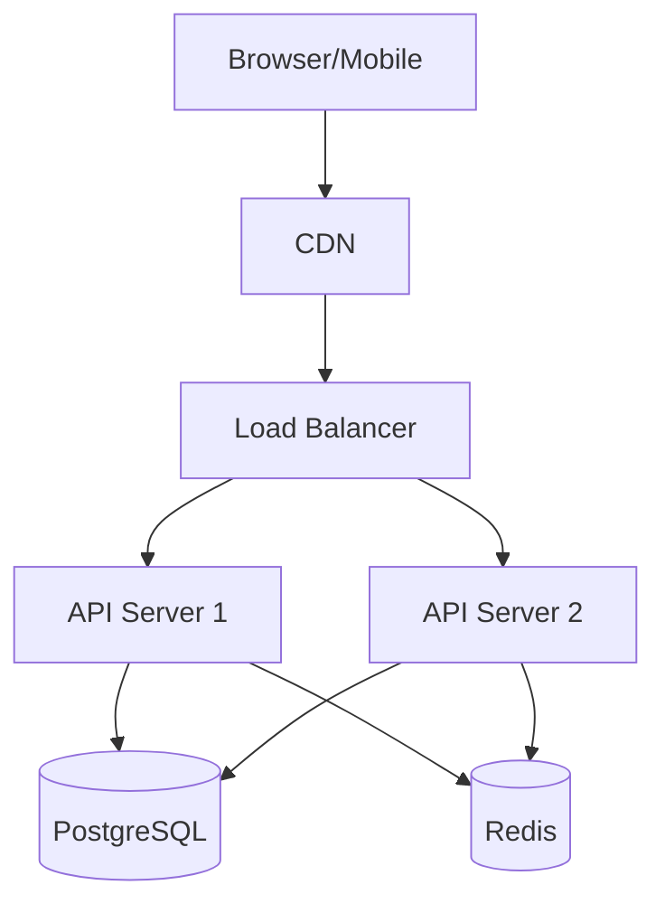

# System Design Checklist

Complete all sections before handing off to implementation.

## 1. Overview

- [ ] High-level system description (1-2 paragraphs)
- [ ] Primary use cases listed
- [ ] System boundaries defined
- [ ] Key assumptions documented

## 2. Architecture Diagram

- [ ] All major components shown
- [ ] Component relationships/dependencies indicated
- [ ] External services identified
- [ ] Data flow direction marked
- [ ] Synchronous vs async communication noted

### Diagram Requirements

```
┌─────────────┐     ┌─────────────┐     ┌─────────────┐
│   Client    │────▶│   API       │────▶│  Database   │
│  (Browser)  │     │  (Backend)  │     │ (PostgreSQL)│
└─────────────┘     └─────────────┘     └─────────────┘
                           │
                           ▼
                    ┌─────────────┐
                    │   Cache     │
                    │   (Redis)   │
                    └─────────────┘
```

Use Mermaid for complex diagrams:



## 3. Component Specifications

For each component, document:

| Aspect | Required |
|--------|----------|
| Responsibility | What this component does |
| Technology | Specific framework/service |
| Interfaces | APIs it exposes |
| Dependencies | What it depends on |
| Scaling approach | How it scales |

### Example Component Spec

```markdown
## API Server

**Responsibility:** Handle HTTP requests, business logic, data validation

**Technology:** Node.js + Express / Python + FastAPI

**Interfaces:**
- REST API at `/api/v1/*`
- WebSocket at `/ws`
- Health check at `/health`

**Dependencies:**
- PostgreSQL (primary data store)
- Redis (caching, sessions)
- S3 (file storage)

**Scaling:** Horizontal via load balancer, stateless design
```

## 4. Data Model

- [ ] All entities defined with fields
- [ ] Field types specified
- [ ] Relationships documented (1:1, 1:N, N:N)
- [ ] Indexes identified for common queries
- [ ] Constraints defined (unique, not null, foreign keys)

### Entity Template

```markdown
## User Entity

| Field | Type | Constraints | Index |
|-------|------|-------------|-------|
| id | UUID | PK | Yes |
| email | VARCHAR(255) | UNIQUE, NOT NULL | Yes |
| passwordHash | VARCHAR(255) | NOT NULL | No |
| displayName | VARCHAR(100) | NOT NULL | No |
| role | ENUM | NOT NULL, DEFAULT 'user' | Yes |
| createdAt | TIMESTAMP | NOT NULL | No |
| updatedAt | TIMESTAMP | NOT NULL | No |

**Relationships:**
- Has many: Posts (1:N)
- Has many: Comments (1:N)
- Belongs to: Organization (N:1)
```

## 5. API Contracts

- [ ] All endpoints defined
- [ ] HTTP methods specified
- [ ] Request/response schemas documented
- [ ] Authentication requirements noted
- [ ] Error responses defined

### Endpoint Template

```markdown
## POST /api/v1/users

**Description:** Create a new user

**Authentication:** None (public endpoint)

**Request Body:**
```json
{
  "email": "string (required)",
  "password": "string (required, min 8 chars)",
  "displayName": "string (required)"
}
```

**Response 201:**
```json
{
  "id": "uuid",
  "email": "string",
  "displayName": "string",
  "createdAt": "ISO8601"
}
```

**Error Responses:**
- 400: Validation error
- 409: Email already exists
```

## 6. Security Architecture

- [ ] Authentication method defined
- [ ] Authorization model (RBAC, ABAC)
- [ ] Token/session management
- [ ] Password requirements
- [ ] Rate limiting strategy
- [ ] Input validation approach
- [ ] Encryption (at rest, in transit)

### Security Checklist

| Area | Approach |
|------|----------|
| Auth | JWT with refresh tokens |
| Password | bcrypt, min 8 chars |
| HTTPS | Required, TLS 1.3 |
| CORS | Whitelist origins |
| Rate limit | 100 req/min per IP |
| SQL injection | Parameterized queries |
| XSS | Content-Security-Policy |

## 7. Deployment Architecture

- [ ] Environments defined (dev, staging, prod)
- [ ] Infrastructure components listed
- [ ] CI/CD pipeline described
- [ ] Secrets management approach
- [ ] Monitoring and logging
- [ ] Backup and recovery

### Environment Matrix

| Component | Development | Staging | Production |
|-----------|-------------|---------|------------|
| Database | Local Docker | RDS (t3.small) | RDS (r5.large) |
| Cache | Local Redis | ElastiCache | ElastiCache (cluster) |
| API | Local | ECS (1 task) | ECS (3+ tasks) |
| CDN | None | CloudFront | CloudFront |

## 8. Scalability Considerations

- [ ] Expected load documented (users, requests/sec)
- [ ] Bottlenecks identified
- [ ] Scaling strategy for each component
- [ ] Caching strategy
- [ ] Database optimization (indexes, read replicas)

## 9. Non-Functional Requirements Mapping

Map each NFR to architectural decision:

| Requirement | Architectural Approach |
|-------------|----------------------|
| Response < 200ms | Redis caching, DB indexes |
| 99.9% uptime | Multi-AZ, auto-scaling |
| Support 10K concurrent | Horizontal scaling, connection pooling |
| GDPR compliance | Data encryption, audit logs, deletion API |

## 10. Final Checklist

Before handoff:

- [ ] Every REQ-XXX mapped to architecture component
- [ ] All ADRs written for major decisions
- [ ] No TBD items remaining
- [ ] Diagrams match text descriptions
- [ ] API contracts complete
- [ ] Security model documented
- [ ] Deployment approach clear
