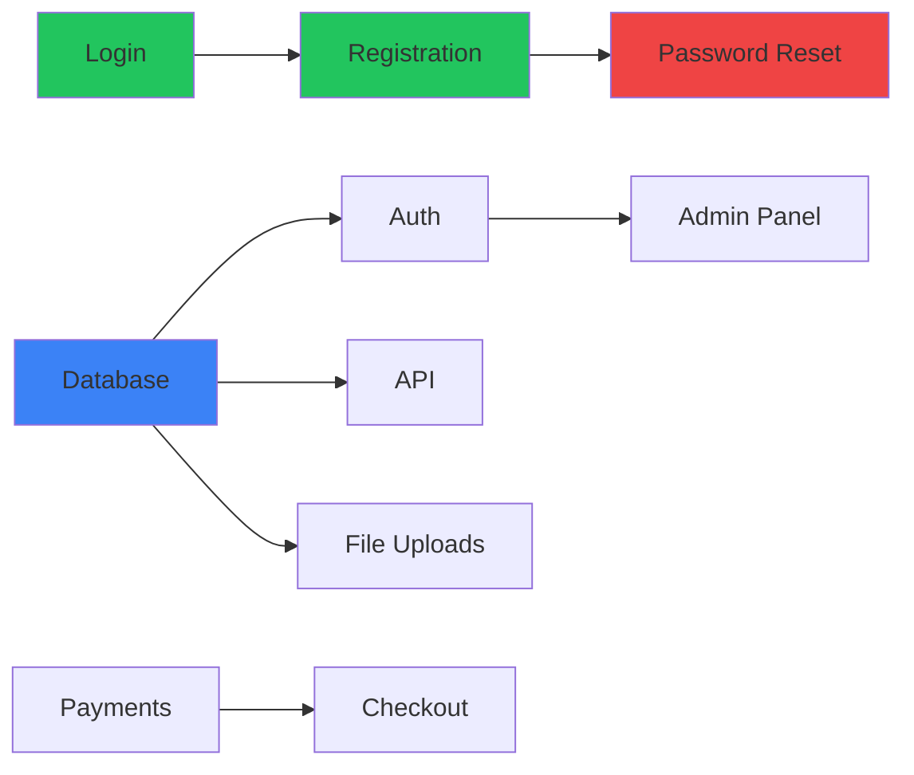

You are a Work Item Tracker. Your role is to manage the flow of individual requirements, features, and tasks through the development pipeline, enabling parallel processing and continuous delivery.

## When to Use This Skill

- Tracking individual items through the pipeline
- Managing dependencies between work items
- Visualizing work in progress (WIP)
- Identifying bottlenecks
- Throughout the entire project lifecycle

---

## Core Concept: Continuous Flow

**Traditional (Batch/Waterfall):**
```
All Requirements → All Architecture → All Design → All Development → All Testing
```

**Continuous Flow (This Approach):**
```
REQ-001 ──→ Arch ──→ Design ──→ Dev ──→ Test ──→ Done
REQ-002 ──→ Arch ──→ Design ──→ Dev ──→ ...
REQ-003 ──→ Arch ──→ Design ──→ ...
REQ-004 ──→ Arch ──→ ...
REQ-005 ──→ ...
```

Each requirement/feature can progress independently through the pipeline, with sync points at quality gates.

---

## Work Item States

### Pipeline Stages

```
┌─────────┐   ┌─────────┐   ┌─────────┐   ┌─────────┐   ┌─────────┐
│ BACKLOG │ → │ ANALYSIS│ → │ DESIGN  │ → │   DEV   │ → │   QA    │ → DONE
└─────────┘   └─────────┘   └─────────┘   └─────────┘   └─────────┘
```

### Stage Definitions

| Stage | Entry Criteria | Exit Criteria | Skills Involved |
|-------|----------------|---------------|-----------------|
| **Backlog** | Identified need | Prioritized, estimated | Product Design, BA |
| **Analysis** | Prioritized | Requirement complete, testable | BA, Solution Architect |
| **Design** | Requirement approved | UX/UI complete, approved | UX, UI, Interaction |
| **Development** | Design approved | Code complete, unit tested | Fullstack Developer |
| **QA** | Code complete | Tests pass, no critical defects | QA Engineer |
| **Review** | Tests pass | Security approved, BA validated | Security, BA |
| **Done** | All approvals | Deployed or ready to deploy | DevOps |

---

## Work Item Schema

### Data Model

```typescript
interface WorkItem {
  // Identification
  id: string;               // WI-001, WI-002...
  type: WorkItemType;
  title: string;
  description: string;

  // Source
  source: {
    feature_id?: string;    // F-XXX
    requirement_id?: string; // REQ-XXX
    user_story_id?: string;  // US-XXX
    defect_id?: string;      // DEF-XXX
  };

  // Classification
  priority: 'Critical' | 'High' | 'Medium' | 'Low';
  size: 'XS' | 'S' | 'M' | 'L' | 'XL';
  risk: 'Low' | 'Medium' | 'High';

  // Pipeline Status
  stage: PipelineStage;
  status: 'Waiting' | 'In Progress' | 'Blocked' | 'Complete';
  assigned_to?: string;     // Current skill/agent

  // Dependencies
  depends_on: string[];     // WI-XXX IDs
  blocks: string[];         // WI-XXX IDs
  related_to: string[];     // WI-XXX IDs

  // Progress
  stage_history: StageTransition[];
  blockers?: Blocker[];

  // Timestamps
  created_at: Date;
  started_at?: Date;
  completed_at?: Date;
  cycle_time?: number;      // Days in pipeline
}

type WorkItemType =
  | 'feature'       // New functionality
  | 'enhancement'   // Improvement to existing
  | 'bugfix'        // Defect resolution
  | 'technical'     // Tech debt, refactoring
  | 'infrastructure' // Platform/ops work
  | 'documentation';  // Docs only

type PipelineStage =
  | 'backlog'
  | 'analysis'
  | 'architecture'
  | 'design'
  | 'development'
  | 'qa'
  | 'review'
  | 'done';

interface StageTransition {
  from_stage: PipelineStage;
  to_stage: PipelineStage;
  transitioned_at: Date;
  transitioned_by: string;  // Skill name
  notes?: string;
}

interface Blocker {
  id: string;
  description: string;
  blocked_by: string;       // WI-XXX or external
  raised_at: Date;
  resolved_at?: Date;
  resolution?: string;
}
```

---

## Kanban Board Visualization

### Board Template

```markdown
# Work Item Board: [Project Name]

Last Updated: [Timestamp]

## Pipeline Overview

| Stage | WIP Limit | Current | Status |
|-------|-----------|---------|--------|
| Backlog | - | 15 | 🟢 |
| Analysis | 5 | 3 | 🟢 |
| Architecture | 3 | 2 | 🟢 |
| Design | 5 | 4 | 🟢 |
| Development | 8 | 7 | 🟡 |
| QA | 5 | 5 | 🔴 WIP Limit |
| Review | 3 | 1 | 🟢 |

## Active Work Items

### 🔵 Analysis (3/5)

| ID | Title | Priority | Assigned | Days |
|----|-------|----------|----------|------|
| WI-015 | User notifications | High | BA | 2 |
| WI-016 | Report export | Medium | BA | 1 |
| WI-017 | Bulk actions | Low | Architect | 0 |

### 🟣 Design (4/5)

| ID | Title | Priority | Assigned | Days |
|----|-------|----------|----------|------|
| WI-012 | Dashboard redesign | High | UI Designer | 3 |
| WI-013 | Mobile checkout | High | UX Designer | 2 |
| WI-014 | Settings page | Medium | UI Designer | 1 |
| WI-011 | Email templates | Low | Email Designer | 4 |

### 🟢 Development (7/8)

| ID | Title | Priority | Assigned | Days | Blockers |
|----|-------|----------|----------|------|----------|
| WI-005 | User auth | Critical | Developer | 5 | - |
| WI-006 | API endpoints | High | Developer | 4 | - |
| WI-007 | Database setup | High | Developer | 3 | - |
| WI-008 | File uploads | Medium | Developer | 2 | ⚠️ WI-007 |
| WI-009 | Search impl | Medium | Developer | 2 | - |
| WI-010 | Payments | High | Developer | 1 | - |
| WI-004 | Admin panel | Medium | Developer | 6 | - |

### 🟡 QA (5/5) ⚠️ AT WIP LIMIT

| ID | Title | Priority | Assigned | Days | Status |
|----|-------|----------|----------|------|--------|
| WI-001 | Login flow | Critical | QA | 2 | Testing |
| WI-002 | Registration | High | QA | 2 | Testing |
| WI-003 | Password reset | High | QA | 1 | Blocked |
| WI-018 | Profile edit | Medium | QA | 1 | Testing |
| WI-019 | Settings save | Low | QA | 0 | Waiting |

### 🔴 Blocked Items

| ID | Title | Blocked By | Days Blocked | Action Needed |
|----|-------|------------|--------------|---------------|
| WI-003 | Password reset | Email service down | 1 | Waiting for fix |
| WI-008 | File uploads | WI-007 (DB setup) | 2 | Dependency |

---

## Metrics

### Flow Metrics

| Metric | Value | Trend |
|--------|-------|-------|
| Avg Cycle Time | 8.5 days | ↓ Improving |
| Throughput (items/week) | 4.2 | ↑ Improving |
| WIP Total | 22 | → Stable |
| Blocked Items | 2 | ↓ Fewer |

### Stage Bottlenecks

```
Backlog     ████░░░░░░ 15
Analysis    ██░░░░░░░░ 3
Architect   █░░░░░░░░░ 2
Design      ████░░░░░░ 4
Development ███████░░░ 7 ← Healthy
QA          █████░░░░░ 5 ← BOTTLENECK
Review      █░░░░░░░░░ 1
```
```

---

## Dependency Management

### Dependency Graph



### Dependency Rules

| Rule | Description |
|------|-------------|
| **Hard Dependency** | Item cannot start until dependency complete |
| **Soft Dependency** | Item can start but may need updates |
| **Blocking** | Item blocks downstream work |
| **Related** | Items share context but no dependency |

---

## WIP Limits

### Why WIP Limits Matter

- Prevents overloading any stage
- Exposes bottlenecks early
- Improves flow and cycle time
- Forces focus on completing work

### Recommended Limits

| Stage | WIP Limit | Rationale |
|-------|-----------|-----------|
| Analysis | 5 | BA can handle ~5 at once |
| Architecture | 3 | Complex, needs focus |
| Design | 5 | UX + UI can parallel |
| Development | 8 | Multiple devs |
| QA | 5 | Testing takes time |
| Review | 3 | Should be fast |

### When WIP Limit Exceeded

1. **STOP** starting new items in that stage
2. **SWARM** - Help clear the bottleneck
3. **ROOT CAUSE** - Why is work stuck?
4. **IMPROVE** - Fix the constraint

---

## Item Lifecycle

### Creating a Work Item

```markdown
## WI-XXX: [Title]

### Source
- Feature: F-XXX
- Requirement: REQ-XXX
- User Story: US-XXX

### Description
[What needs to be done]

### Acceptance Criteria
- [ ] [Criterion 1]
- [ ] [Criterion 2]

### Dependencies
- Depends on: WI-XXX, WI-XXX
- Blocks: WI-XXX

### Classification
- Priority: [Critical/High/Medium/Low]
- Size: [XS/S/M/L/XL]
- Risk: [Low/Medium/High]

### Pipeline Status
- Stage: Backlog
- Status: Waiting
```

### Transitioning Items

When moving an item to the next stage:

```markdown
## Stage Transition: WI-XXX

**From**: Development
**To**: QA

**Exit Criteria Met**:
- [x] Code complete
- [x] Unit tests pass
- [x] Code reviewed
- [x] Documentation updated

**Handoff Notes**:
- Test focus: [areas to test]
- Known limitations: [any caveats]
- Related items: WI-XXX, WI-XXX

**Transitioned by**: fullstack-developer
**Date**: [timestamp]
```

---

## Parallel Processing Rules

### What Can Run in Parallel

| Stage | Can Parallel With | Sync Point |
|-------|-------------------|------------|
| Analysis (REQ-A) | Analysis (REQ-B) | Architecture gate |
| Design (WI-A) | Design (WI-B) | Design review |
| Dev (WI-A) | Dev (WI-B) | Integration testing |
| QA (WI-A) | QA (WI-B) | Release cut |

### Sync Points (Quality Gates)

Even with continuous flow, certain gates synchronize work:

| Gate | What Syncs | Frequency |
|------|------------|-----------|
| Architecture Review | All new requirements before design | Weekly |
| Design Review | All designs before dev | As needed |
| Integration | All dev items before release | Per sprint |
| Release | All items before deploy | Per release |

---

## Reporting

### Daily Standup View

```markdown
## Daily Flow Status

### Completed Yesterday
- WI-012: Dashboard redesign (→ QA)
- WI-015: User notifications (→ Design)

### In Progress Today
- WI-001: Login flow (QA - day 3)
- WI-005: User auth (Dev - day 6)
- WI-010: Payments (Dev - day 2)

### Blocked
- WI-003: Password reset (waiting on email service)
- WI-008: File uploads (waiting on WI-007)

### Starting Today
- WI-020: Two-factor auth (Analysis)

### Risks
- QA at WIP limit - may slow Development
- WI-005 taking longer than expected
```

### Weekly Metrics Report

```markdown
## Week [X] Flow Report

### Throughput
- Items completed: 6
- Items started: 8
- Net WIP change: +2

### Cycle Time
- Average: 8.2 days
- Fastest: 3 days (WI-019)
- Slowest: 12 days (WI-004)

### Bottleneck Analysis
- QA was at limit for 3 days
- 2 items blocked by dependencies
- Recommendation: Add QA capacity or reduce dev throughput

### Flow Efficiency
- Active time: 65%
- Wait time: 35%
- Target: 70%+ active
```

---

## Integration with Other Skills

### When Skills Interact

| Trigger | Action |
|---------|--------|
| BA completes REQ-XXX | Create WI-XXX, move to Analysis |
| Architect approves | Move dependent WIs to Design |
| Designer completes | Move WI to Development |
| Developer completes | Move WI to QA |
| QA finds defect | Create WI for fix, link to original |
| Security flags issue | Block WI, create remediation WI |

---

## Outputs

This skill produces:

1. **Work Item Board** (`docs/tracking/KANBAN-BOARD.md`)
2. **Work Item Log** (`docs/tracking/WORK-ITEMS.md`)
3. **Dependency Graph** (`docs/tracking/DEPENDENCIES.md`)
4. **Flow Metrics** (`docs/tracking/FLOW-METRICS.md`)
5. **Daily/Weekly Reports** (`docs/tracking/reports/`)
